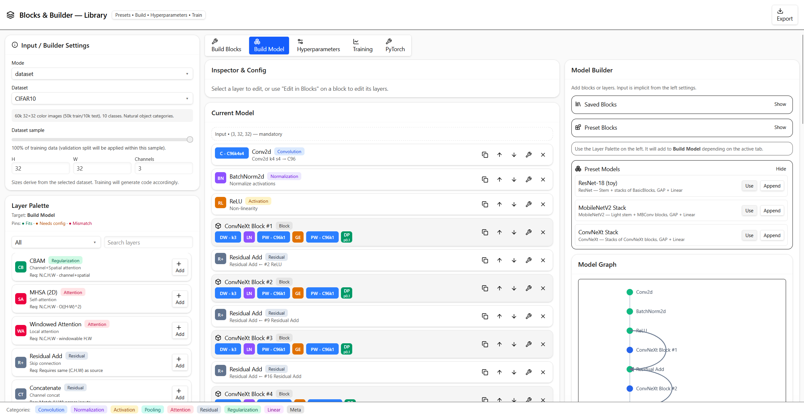
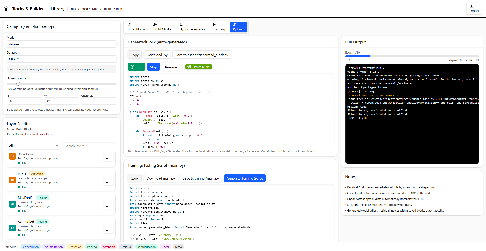
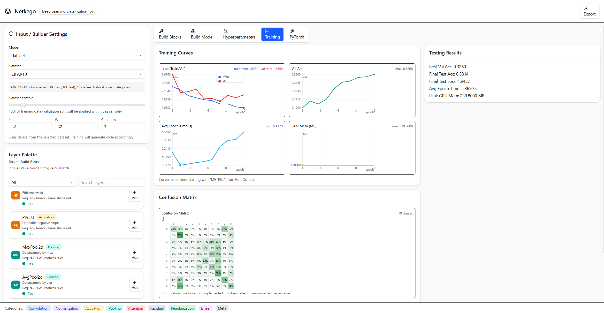

# Netkego — Visual CNN/Model Builder + PyTorch Codegen

Netkego is a React + Vite app to visually assemble blocks and models, preview shapes/params/FLOPs, pick datasets and hyperparameters, and generate runnable PyTorch code. It includes a tiny runner that executes the generated code in a local virtual environment and streams logs back to the UI.

| Build Blocks |  
| --- |  
|  |  

| Build Model |  
| --- |  
|  |  

| Training |  
| --- |  
|  |  


## Features

- Layer Palette and Preset Blocks/Models
- Build Blocks and Build Model with residual auto-wiring and shape checks
- Dataset mode (CIFAR-10/100, MNIST, Fashion-MNIST, STL10) with descriptions
- Hyperparameters: optimizers, schedulers (including None), batch size, workers, etc.
- Device selection: Auto, CUDA, MPS, CPU
- Training script generator (dataset-aware) with tqdm progress and metrics parsing
- Per-step and per-epoch checkpoint saving; last/best checkpoints
- Training tab with curves (axes/labels) and testing metrics

## Prerequisites

- Node.js 18+ and npm
- Linux/macOS
- For CUDA/MPS you need a compatible PyTorch build and hardware; default install is CPU-only wheels.

## Quick start

1) Install and start the UI

```bash
npm install
npm run dev
```

Open the URL printed by Vite (usually http://localhost:5173).

2) Prepare the Python env (first run)

```bash
npm run py:setup
```

This uses `uv` to create `.venv` and installs PyTorch (CPU wheels), torchvision, and tqdm. If `uv` is not present it will be installed.

3) Generate and run code

- Build your Block/Model and switch to the PyTorch tab.
- Click “Generate Training Script” (dataset mode required) and “Save to .runner/main.py”.
- Click “Save to runner/generated_block.py” for the generated module.
- Click “Run” to execute the training in the background.

The Run Output panel streams logs; a blue progress bar shows per-epoch tqdm progress. The Training tab shows curves parsed from `METRIC:` lines.

## Datasets

Select “Dataset” mode in the left panel, then choose one:

- CIFAR-10 — 60k 32×32 color images, 10 classes (50k train/10k test)
- CIFAR-100 — 60k 32×32 color images, 100 classes
- MNIST — 70k 28×28 grayscale digits, 10 classes (60k/10k)
- Fashion-MNIST — 70k 28×28 grayscale apparel, 10 classes
- STL10 — 13k labeled 96×96 color images (5k/8k) + 100k unlabeled

The UI enforces input size/channels and offers a one-click fix to align the final Linear layer’s out features to the dataset’s number of classes.

## Hyperparameters

- Optimizers: SGD (momentum), AdamW
- LR Schedulers: None, Cosine, Cosine with Warm Restarts (T0/Tmult), Step (stepSize/gamma)
- Batch size, data workers, weight decay, warmup, epochs, val split, grad clip, label smoothing, Mixup/CutMix, stochastic depth (UI only placeholder in code for SD)
- Device: Auto (CUDA▶MPS▶CPU), CUDA, MPS, CPU

## Generated training script

Key characteristics:

- Resolves device preference and availability
- Loads torchvision datasets with basic normalization; splits train/val
- Uses tqdm for train/val loops; prints one `EPOCH:` line per epoch
- Emits `METRIC:` lines (epoch, train_loss, val_loss, val_acc) and `BEST:` on improvement; prints `TEST:` at the end
- Saves checkpoints:
	- Per step: `checkpoints/step_<global_step>.pt` and `last_step.pt`
	- Per epoch: `checkpoints/epoch_XXX.pt` and `last.pt`
	- Best: `checkpoints/best.pt`
- Safety: if the model has zero parameters, it auto-wraps with a small Linear head sized to the dataset classes.

The generated module (`runner/generated_block.py`) exports `CIN/H/W` and `GeneratedBlock`, and also `GeneratedModel` when you build a model.

## Running without datasets

Use “Custom” mode to explore shapes/params/FLOPs with random tensors. The PyTorch tab lets you run a forward pass only; training generation is disabled.

## Where things go

- Generated code: `runner/generated_block.py` (UI saves here)
- Training script: `.runner/main.py` (UI saves here)
- Checkpoints: `./checkpoints/`
- Run output log (served to UI): `public/run_output.txt`

## Developer notes

- Frontend: React + Vite; Tailwind-like classes; Lucide icons
- Code organization:
	- `src/lib/constants.js` — layer catalogs, presets, dataset metadata
	- `src/lib/utils.js` — utilities
	- `src/components/builder/*` — palette, previews, metrics, progress
	- `src/App.jsx` — main UI, code generation
	- `runner/run.py` — Python runner that executes `.runner/main.py` with `__name__ == "__main__"`

## Troubleshooting

- tqdm spam in logs: The UI filters tqdm’s carriage-return text and renders a visual progress bar instead.
- Optimizer error: “optimizer got an empty parameter list” — add a final Linear layer or let the generator’s auto-wrapper add a small head.
- Missing packages: Run `npm run py:setup` again. The default installs CPU wheels: `torch torchvision tqdm`.
- CUDA/MPS not used: Switch Device to `cuda` or `mps` and ensure your environment supports it (correct wheels, drivers, hardware).
- No curves: Ensure training prints `METRIC:` lines (the generated script does this by default) and open the Training tab.

## Scripts

- `npm run dev` — start the UI (Vite)
- `npm run py:setup` — create .venv and install Python deps (CPU wheels)
- `npm run py:run` — run the Python runner (expects previously saved code)
- `npm run py:setup-run` — install + run in sequence

## License

MIT
